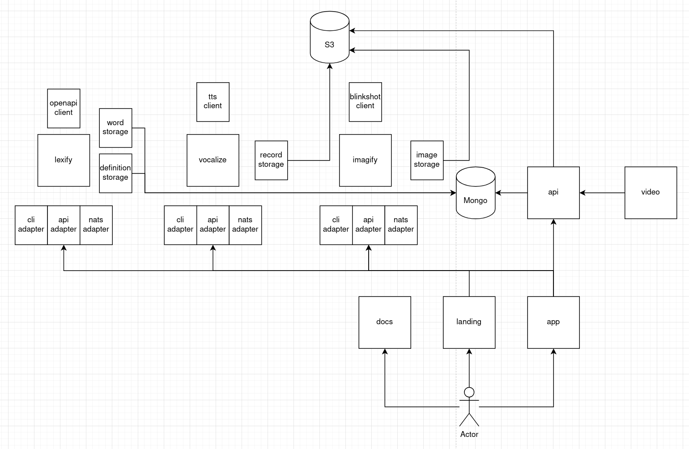

# Architecture

Our backends can be divided into 3 main parts:

1. Definition services

- `lexify` - generates word definitions
  - uses llm to generate definition
  - stores definition in mongodb
  - uses word storage to check if word is correct
- `vocalize` - responsible for word pronunciation
  - uses llm to generate word pronunciation
  - stores pronunciation in s3
- `imagify` - generates images of words
  - uses AI to generate image
  - stores image in s3

Those services work independently of users and are not aware of most db collections.

You can use them not only by `API` but also as `CLI`. Thanks to `hexagonal architecture` they are easy to test and extend (for example to queue interface like `NATS`).

2. API

Only `HTTP` based communication is allowed and in most cases requires `JWT` token, so interacting with `API` you are acting as user saved in `db`.

3. Auxilary

- `video`, this service waiting for new videos requests defined by users in API and then return stream with ready video to save for `API`.

These services can't be running without `API` and fully relay on it.

