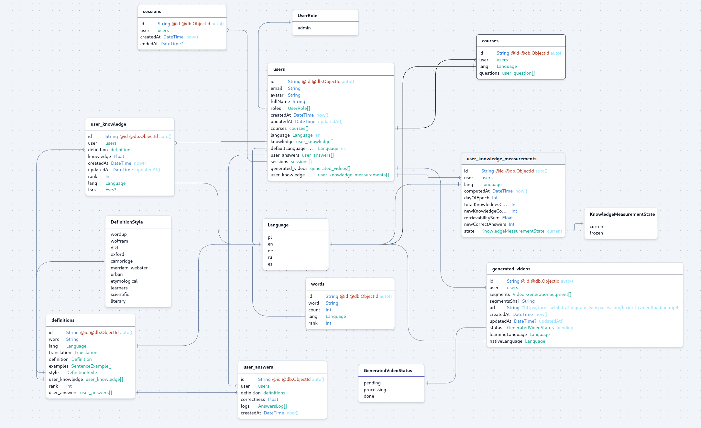

# Data model



Generated at 2025-04-02 by [prisma-editor](https://prisma-editor.vercel.app)

You can find details in `prismadb/schema.prisma` file in `api` folder.

```prisma
// This is your Prisma schema file,
// learn more about it in the docs: https://pris.ly/d/prisma-schema

// Looking for ways to speed up your queries, or scale easily with your serverless or edge functions?
// Try Prisma Accelerate: https://pris.ly/cli/accelerate-init

generator client {
  provider = "prisma-client-js"
}

datasource db {
  provider = "mongodb"
  url      = env("MONGO_URI")
}

enum Language {
  pl
  en
  de
  ru
  es
}

type Translation {
  pl String
  en String
  de String
  ru String
  es String
}

type Definition {
  pl String
  en String
  de String
  ru String
  es String
}

type SentenceExample {
  part_of_speech String // eg noun
  pl             String
  en             String
  de             String
  ru             String
  es             String
  image_prompt   String
}

enum DefinitionStyle {
  wordup
  wolfram
  diki
  oxford
  cambridge
  merriam_webster
  urban
  etymological
  learners
  scientific
  literary
}

model definitions {
  id             String            @id @default(auto()) @map("_id") @db.ObjectId
  word           String
  lang           Language
  translation    Translation
  definition     Definition
  examples       SentenceExample[]
  style          DefinitionStyle
  user_knowledge user_knowledge[]
  rank           Int
  user_answers   user_answers[]
}

model words {
  id    String   @id @default(auto()) @map("_id") @db.ObjectId
  word  String
  count Int
  lang  Language
  rank  Int
}

enum UserRole {
  admin
}

model users {
  id                          String                        @id @default(auto()) @map("_id") @db.ObjectId
  email                       String                        @unique
  avatar                      String
  fullName                    String
  roles                       UserRole[]                    @default([])
  createdAt                   DateTime                      @default(now())
  updatedAt                   DateTime                      @updatedAt
  courses                     courses[]                     @relation("user_course")
  language                    Language                      @default(en)
  knowledge                   user_knowledge[]
  defaultLanguageToLearn      Language                      @default(es)
  user_answers                user_answers[]
  sessions                    sessions[]
  generated_videos            generated_videos[]
  user_knowledge_measurements user_knowledge_measurements[]
}

type VideorGenerationSegment {
  audioUrl  String
  imageUrl  String
  text      String
  highlight String
}

enum GeneratedVideoStatus {
  pending
  processing
  done
}

model generated_videos {
  id               String                    @id @default(auto()) @map("_id") @db.ObjectId
  userId           String                    @db.ObjectId
  user             users                     @relation(fields: [userId], references: [id])
  segments         VideorGenerationSegment[]
  segmentsSha1     String
  url              String                    @default("https://preciselab.fra1.digitaloceanspaces.com/lexidrift/video/loading.mp4")
  createdAt        DateTime                  @default(now())
  updatedAt        DateTime?                 @updatedAt
  status           GeneratedVideoStatus      @default(pending)
  learningLanguage Language
  nativeLanguage   Language
}

model sessions {
  id        String    @id @default(auto()) @map("_id") @db.ObjectId
  userId    String    @db.ObjectId
  user      users     @relation(fields: [userId], references: [id])
  createdAt DateTime  @default(now())
  endedAt   DateTime?
}

type user_question {
  definitionId String   @db.ObjectId
  lang         Language
  correctInRow Int
  fsrs         Fsrs?
}

model courses {
  id        String          @id @default(auto()) @map("_id") @db.ObjectId
  userId    String          @db.ObjectId
  user      users           @relation("user_course", fields: [userId], references: [id])
  lang      Language
  questions user_question[]

  @@unique([userId, lang])
}

type Fsrs {
  stability      Float
  difficulty     Float
  nextQuestionAt DateTime
  lastQuestionAt DateTime
}

model user_knowledge {
  id           String      @id @default(auto()) @map("_id") @db.ObjectId
  userId       String      @db.ObjectId
  user         users       @relation(fields: [userId], references: [id])
  definitionId String      @db.ObjectId
  definition   definitions @relation(fields: [definitionId], references: [id])
  knowledge    Float // 0-1 (0 no knwown, 1 known) scale
  createdAt    DateTime    @default(now())
  updatedAt    DateTime    @updatedAt
  rank         Int
  lang         Language

  fsrs Fsrs?

  // @@index([userId, definitionId])
  @@unique([userId, definitionId])
}

type AnswersLog {
  questionAt  DateTime
  answerAt    DateTime
  timeTakenMs Float // ms
  hintLevel   Int // 0-1 (0 no hint, 0.25 sentence, 0.5 img, 0.75 definition, 1 translation)
  answer      String
  // TODO: measurement of accuracy of the answer (eg. Levenshtein distance)
  correct     Boolean
}

model user_answers {
  id           String       @id @default(auto()) @map("_id") @db.ObjectId
  userId       String       @db.ObjectId
  user         users        @relation(fields: [userId], references: [id])
  definitionId String       @db.ObjectId
  definition   definitions  @relation(fields: [definitionId], references: [id])
  correctness  Float // if first log was correct but taking into account hint level = (correct - hintLevel) * 1.001 / (1 + 0.001 e^(0.0005 timeMs))
  // plot 1.001 / (1 + 0.001 e^(0.0005 x)) for x from 0 to 20000, y from 0 to 1
  logs         AnswersLog[]
  createdAt    DateTime     @default(now())
}

enum KnowledgeMeasurementState {
  current
  frozen
}

model user_knowledge_measurements {
  id                   String                    @id @default(auto()) @map("_id") @db.ObjectId
  userId               String                    @db.ObjectId
  user                 users                     @relation(fields: [userId], references: [id])
  lang                 Language
  computedAt           DateTime                  @default(now())
  dayOfEpoch           Int // day from 1970-01-01
  totalKnowledgesCount Int // total number of known words
  newKnowledgeCount    Int // number of new words today
  retrievabilitySum    Float // sum of all retrievability
  newCorrectAnswers    Int // number of correct answers
  state                KnowledgeMeasurementState @default(current)

  @@unique([userId, lang, dayOfEpoch])
}
```