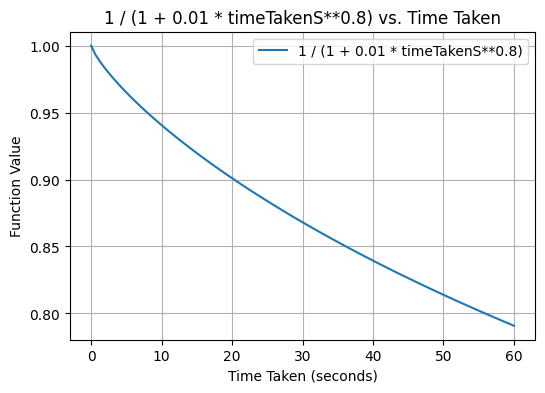

# Repetitions

To memorize pice of information you can use spaced repetition algorithm.

There are 2 types repetition algorithms:
- que based - useful for words that are not memorized yet
- schedule based - better if you now memorized something but will forget in future

In `queue based` algorithm you're just moving index of selected question in queue of questions,
so you can repeat the same question many times during single learning session. It is useful for new knowledge.

In `schedule based` you relay on time interval that decide which questions should be added to next learning session.

We are using both in the following way:

1. When you see new word / respond incorrectly / ask for hint
2. Then `queue based` approach is used. Word will be queued in distances:
   - 2
   - 4
   - 8
   - 16
   - 32
3. If you still can respond correctly to selected question after 32 other questions, it means that we con move to `schedule based` repetition. 
4. In this case we're computing `final correctness` as lowest of `correctness` of all previous answers during this session.
5. When `correctnes` of single answer is:
  - 0 - if answer do not belong to possible translations (trimmed, case-insensitive)
  - (1 - `hintLevel`) * (1 / (1 + 0.01 * (`timeTakenMs`/1000)**0.8)) - if answer is correct

Hint level can be:
- 0 - no hint
- 0.25 - only sentence was revealed
- 0.5 - sentence and image
- 1 - image sentence and translated sentence displayed

I correctness we're taking into account time taken to answer but its impact is usually small.

Using one minute to figure out answer you will lose only 20% of correctness.

But thanks to this we can distingues between super easy and just easy words for you.

Originally FSRS is adjusted to scale of correctness:

    1 : again
    2 : hard
    3 : good
    4 : easy

While our app using `0-1` scale so we just mapping it using linear function. We are using version `FSRS-5` describe in links:

- [The Algorithm](https://github.com/open-spaced-repetition/fsrs4anki/wiki/The-Algorithm)
- [Awesome FSRS](https://github.com/open-spaced-repetition/fsrs4anki/wiki/Awesome-FSRS)

This model uses `Three Component Model of Memory` called `DSR`:
- Difficulty (D): The inherent complexity of particular information.
- Stability (S): The time, in days, required for R to decrease from 100% to 90%.
- Retrievability (R): The probability that the person can successfully recall a particular piece of information at a given moment.

You can read more about this model in [ABC-of-FSRS](https://github.com/open-spaced-repetition/fsrs4anki/wiki/ABC-of-FSRS).